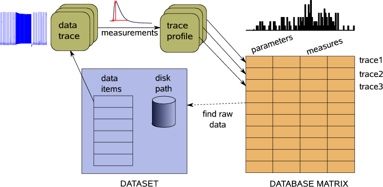
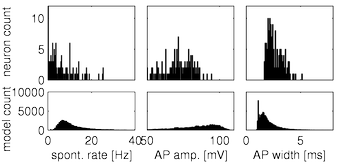

# Database analysis and visualization of simulated and recorded electrophysiological data

PANDORA is a Matlab Toolbox that makes electrophysiology data analysis and database construction accessible. 

__New:__ *See the tutorials in the wiki section.*

See the <a href="wiki/">Wiki</a> for the news.

PANDORA works by extracting user-defined characteristics from raw neural data (e.g., voltage traces) and creating numerical database tables from them. These tables can then be subjected to further analyses, such as drug and parameter effects, statistical, correlation, and principal components. Publication-ready plots can be produced with an embedded plotting system. 

Pandora can be used just to detect spikes and extract features without constructing databases. It also comes with a powerful plotting system.

Features:

1. Works offline within Matlab
2. Requires no external software
3. Is object oriented and allows easy extensions
4. Can easily tie with existing Matlab scripts
5. Can query a database as in SQL

See the <a href="download/">Documentation</a>, <a href="wiki/">Wiki</a>, and <a href="screenshots/">Images</a> links on this page for more information.

##  Reading an electrophysiology dataset from files and creating a database in PANDORA

Data items from recordings or simulations can be used to generate a
database in PANDORA. For this, you must define a way to extract the
same characteristics (such as firing rate, spike amplitude, etc.) from
each of these data items. Once such a transformation is defined,
PANDORA can scan your dataset and create a database of these extracted
characteristics. This database can then be queried and be subjected to
further analyses. Once interesting items are found, raw data items can
be consulted.

## Distributions of extracted characteristics in databases

Spontaneous firing rate, action potential amplitude and half-width
characteristic distributions from the model neuron database were
similar and overlapped with distributions from the recorded neuron
database.

